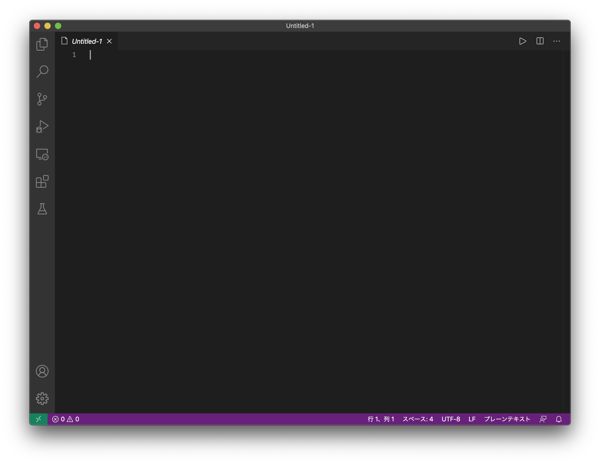
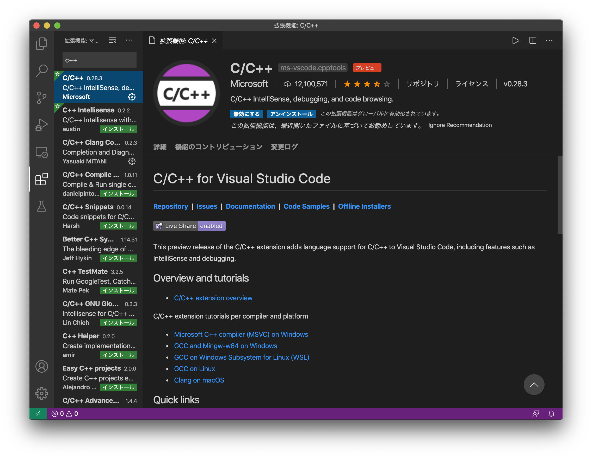
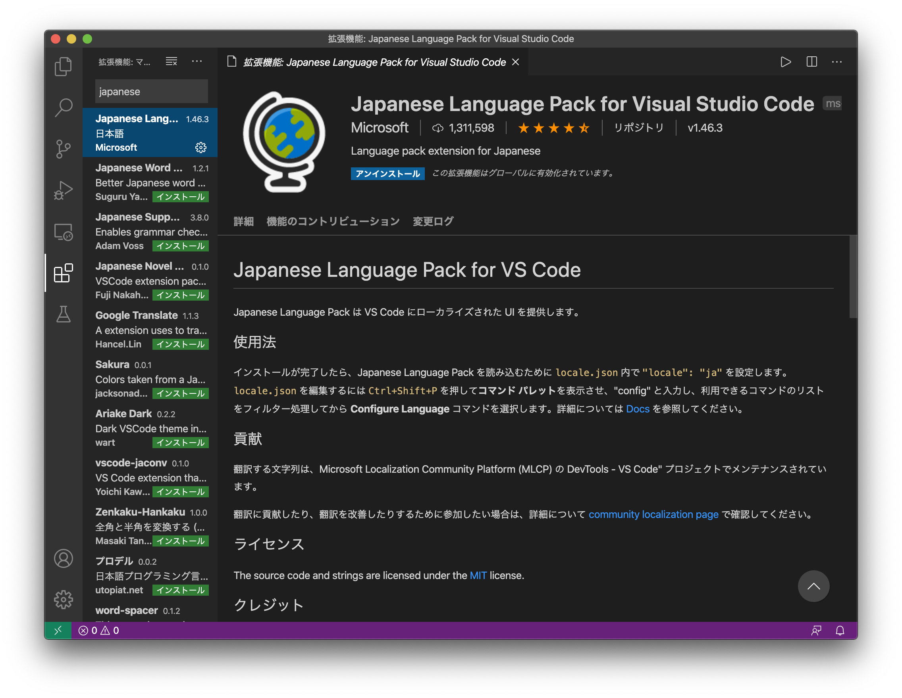
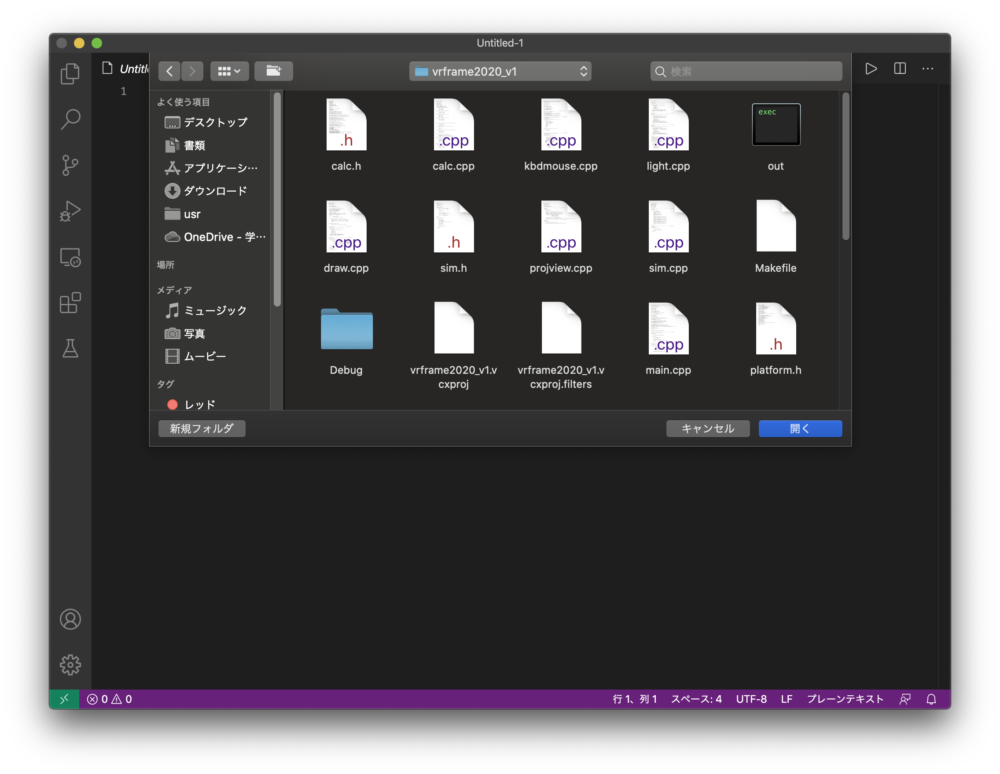
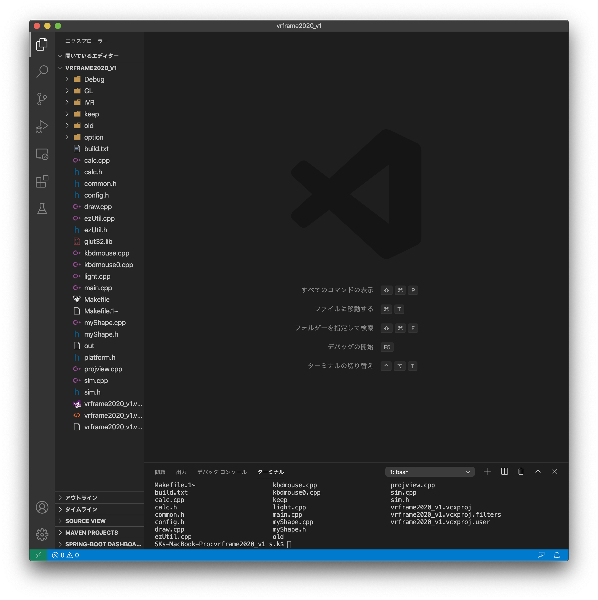
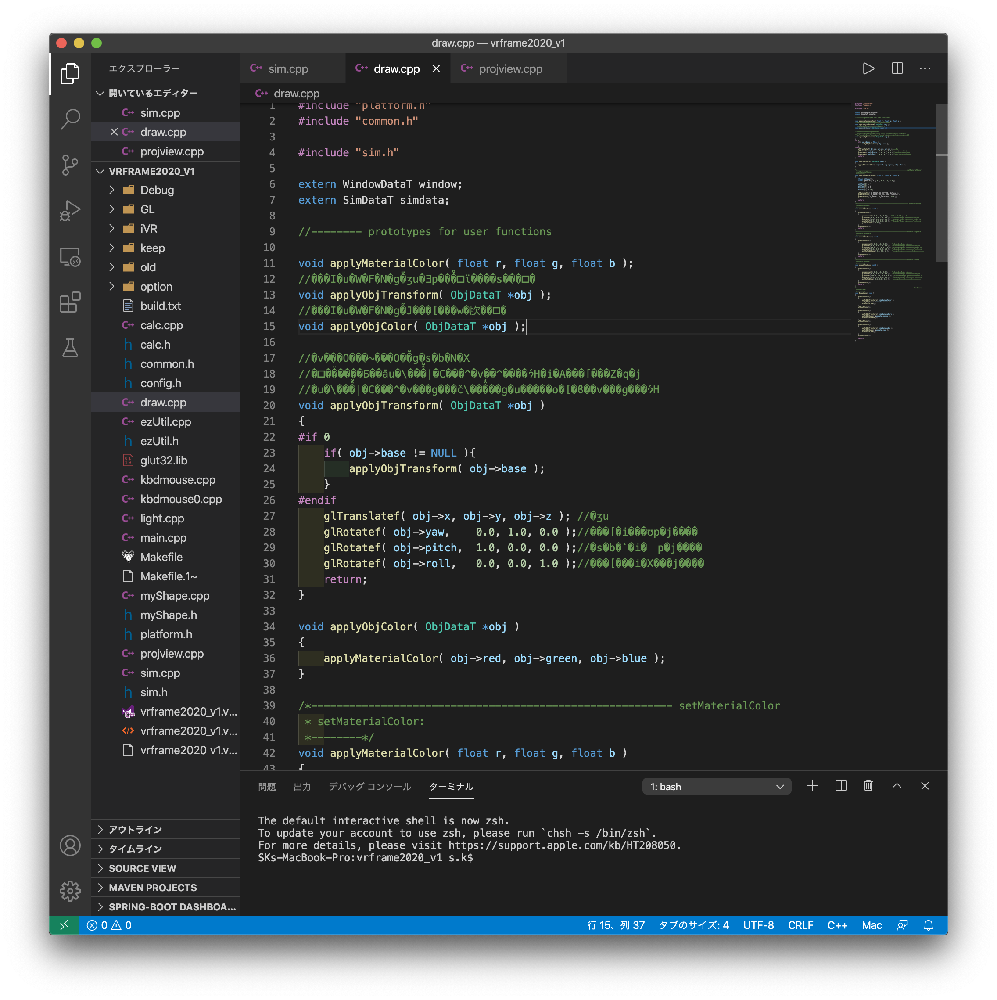
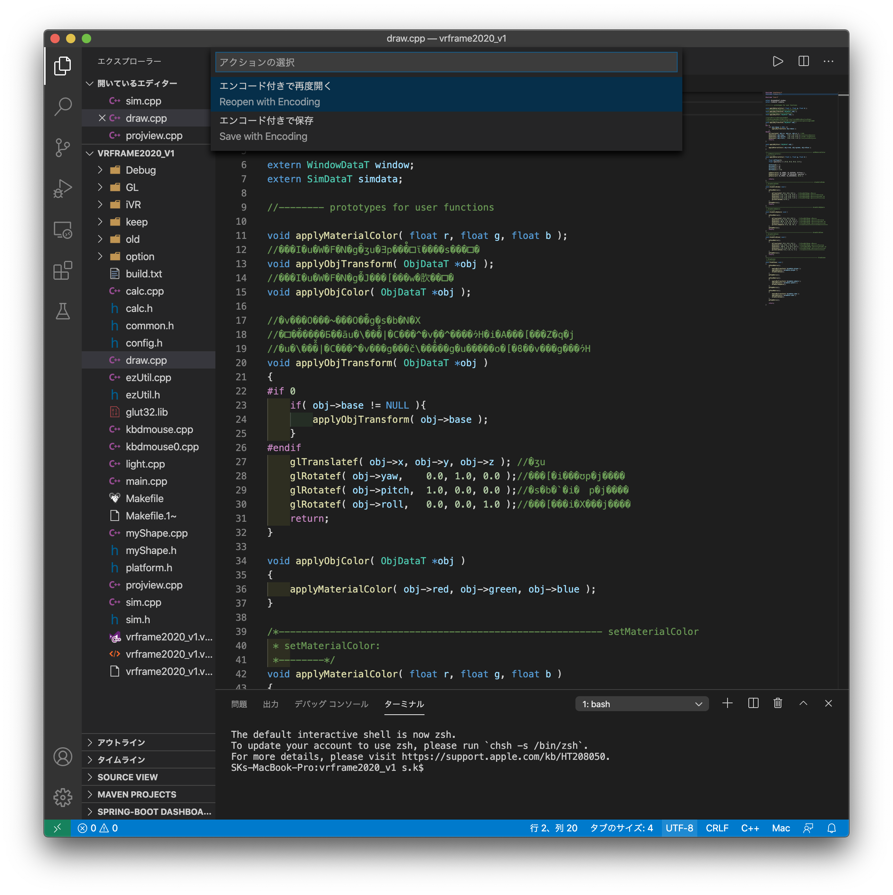
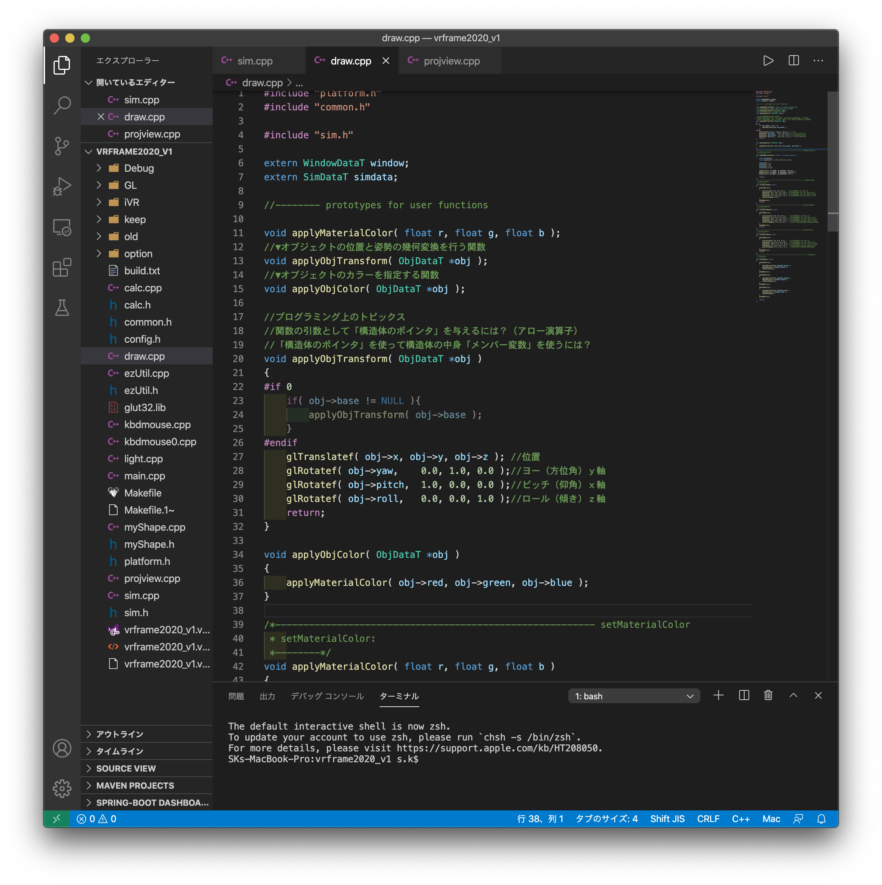
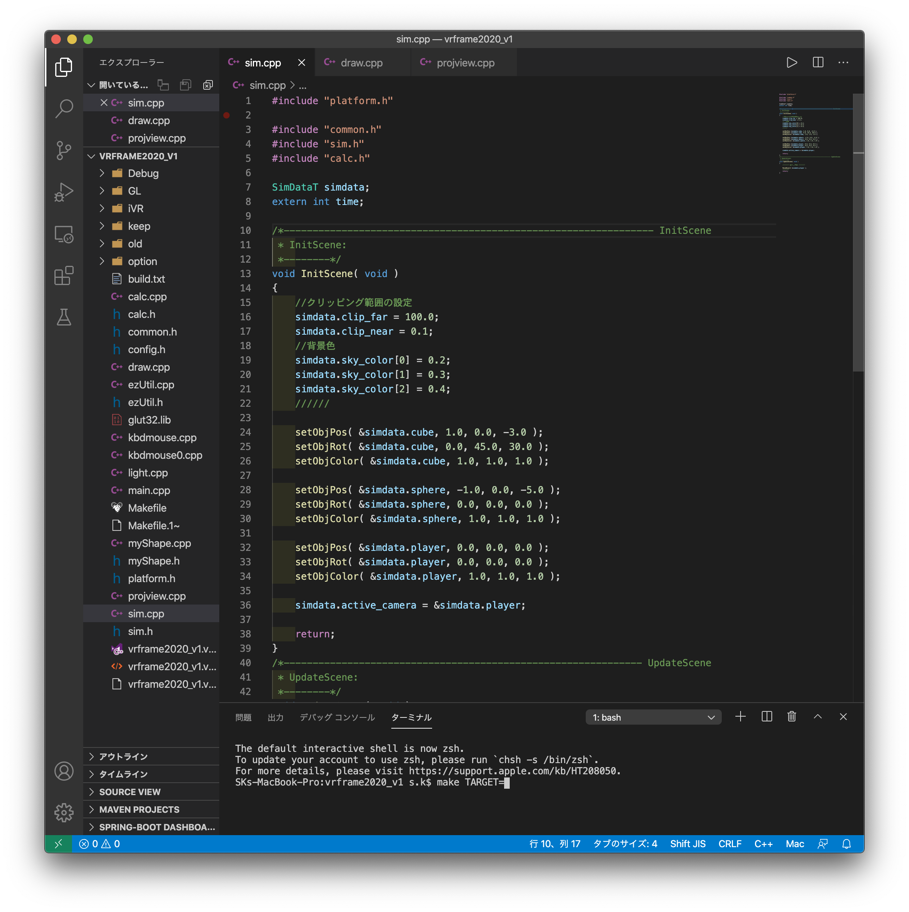

## vscode マニュアル

---

1. [ここ](https://azure.microsoft.com/ja-jp/products/visual-studio-code/)からダウンロード

   起動するとこんな画面が出ると思います

   

2. このボタンを押してください

   

   左上の入力バーに"C++"と入力して出てきたこの拡張をインストールしましょう

   

   日本語で使いたい場合はこれもインストールしましょう

   

   これで一通りインストールは完了です

3. メニューバーのファイル → 開く を選択し、glframe2020_v1_basic/vrframe2020_v1フォルダを選択して開きましょう

   

   この状態で**ファイルを選択せず**に開くを押してください！

   すると以下のような画面になると思います

   

4. 文字コードの変換方法について説明します

   試しにdraw.cppを開いてみましょう

   

   このように文字化けしてしまっています

   右下を見るとUTF-8と書かれています。これが今の文字コードです。

   これをShift-Jisに変換します。

   UTF-8をクリックし、エンコード付きで再度開くを選択します。

   

   入力バーにShift-JisもしくはJapaneseと入力して出てきたものを選択してください。

   するとこのように文字化けが直ると思います。

   

   同様に他のファイルも変更してみてください！
   
   またターミナルは上のメニューバーから呼び出せるので基本的にこのアプリケーション内で作業を完結させることができます。
   
   
   
   上の開くときにフォルダを開いておくと、ターミナルを開いたとき自動でcdした状態で始まるのでとても楽です。